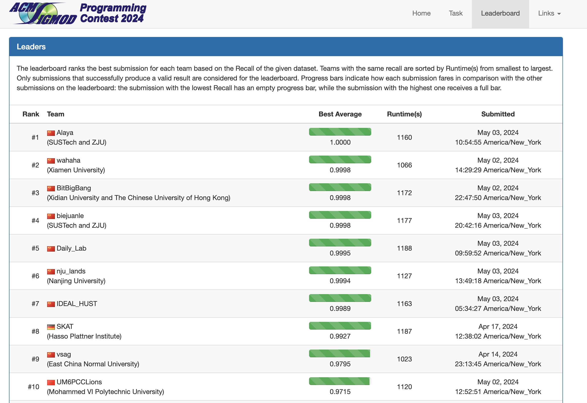

# SIGMOD2024-Programming-Contest-BitBigBang
This repository is an open-source code for the [SIGMOD 2024 Programming Contest](http://sigmodcontest2024.eastus.cloudapp.azure.com/index.shtml), which challenges participants to design and implement efficient and scalable algorithms for **Hybrid Vector Search** in high dimensional space. Our team, BitBigBang, was honored to become finalists.



## About BitBigBang
BitBigBang is a team originating from Xidian University and The Chinese University of Hong Kong, united by their passion for algorithm design and high-dimensional data search. The team has demonstrated exceptional skill and teamwork, leading them to become finalists in the prestigious SIGMOD 2024 Programming Contest.

Members: 

| Name        | Institution                      | Email                         |
|-------------|----------------------------------|-------------------------------|
| Tong Wu     | Xidian University                | twu_1@stu.xidian.edu.cn       |
| Shuo Yang   | Xidian University                | yangsh@stu.xidian.edu.cn      |
| Jiadong Xie | The Chinese University of Hong Kong | jdxie@se.cuhk.edu.hk       |

Advisor: 
| Name        | Institution                      | Email                         |
|-------------|----------------------------------|-------------------------------|
| Yingfan Liu | Xidian University                | liuyingfan@xidian.edu.cn      |

## Task Overview
For this year's contest, the task is to build an index for a set of vectors with attributes for answering hybrid vector queries. The index is required to efficiently find approximate k nearest neighbors of a given query vector under one given similarity measure, such as Euclidean distance, while satisfying the constraints on non-vector attributes.

For this task, you are asked to construct an index for one dataset, which contains a set of high-dimensional vectors with a categorical attribute and a timestamp attribute. The distances between vectors are measured by Euclidean distance, the categorical attribute is discretized into integers and the timestamp attribute is normalized into floats between 0 and 1. The challenge here is to answer hybrid vector queries accurately in a limited time.

## Server Configuration

The hardware and software environment of the server we use is as follows. In order to be able to accurately reproduce our code, please make sure that your environment is compatible with ours.

### Hardware Specifications

- **CPU**: Intel(R) Xeon(R) Platinum 8269CY @ 2.50GHz
- **Memory**: 64 GB RAM

### Operating System

- **OS**: Ubuntu 22.04 LTS

### Software Requirements

- **GCC**: Version 11.4. Ensure that GCC 11.4 is installed for correct compilation.

## Execution

First of all, you'd better clean the cache file.
```bash
bash prepare.sh 
```

Then, You can run our best-submission code by run.sh.
```bash
bash run.sh 
```
